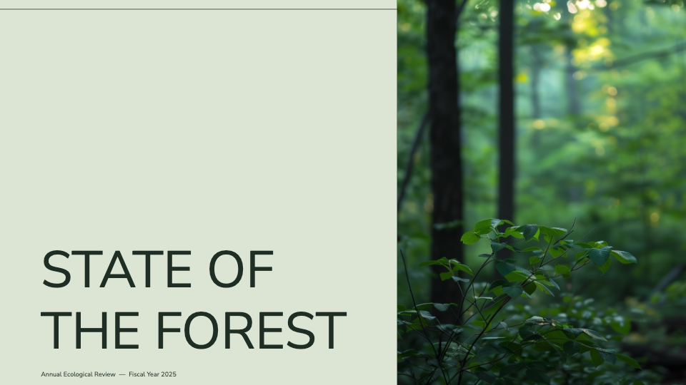
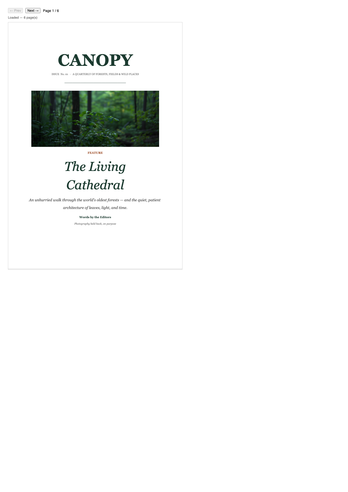
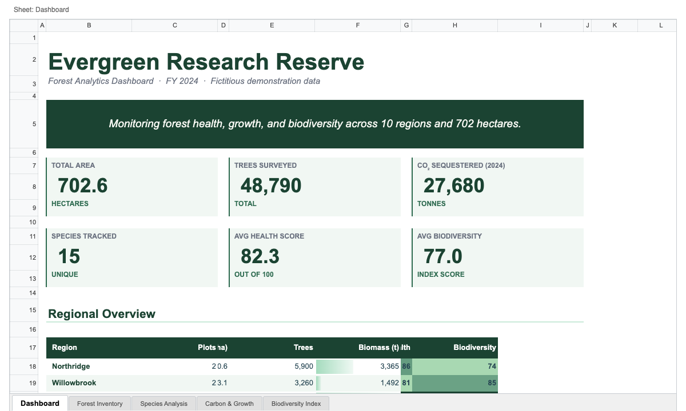
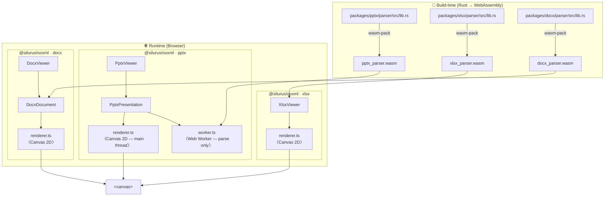

> **This entire codebase — Rust parsers, TypeScript renderers, tests, and tooling — was implemented by [Claude](https://claude.ai)** (Anthropic's AI assistant) through iterative prompting. No human-written application code exists in this repository.

# office-open-xml-viewer

[](https://www.npmjs.com/package/@silurus/ooxml)
[](https://www.npmjs.com/package/@silurus/ooxml)
[](./LICENSE)

**[Demo (Storybook)](https://yukiyokotani.github.io/office-open-xml-viewer/)**

A browser-based viewer for Office Open XML documents that renders to an HTML Canvas element.
The parsers are written in Rust and compiled to WebAssembly; the renderers use the Canvas 2D API.
Each format also exposes a headless engine (`PptxPresentation` / `DocxDocument` / `XlsxWorkbook`) that renders into any caller-supplied canvas, so you can compose your own UI — scroll views, thumbnail grids, master-detail panes — instead of being locked into the built-in viewer. See the `Examples` section in [the Storybook demo](https://yukiyokotani.github.io/office-open-xml-viewer/).

| PPTX | DOCX | XLSX |
|:---:|:---:|:---:|
|  |  |  |

```bash
npm install @silurus/ooxml
# or
pnpm add @silurus/ooxml
```

> **Bundler note**: this package embeds `.wasm` files. With Vite add [`vite-plugin-wasm`](https://github.com/Menci/vite-plugin-wasm); with webpack use [`experiments.asyncWebAssembly`](https://webpack.js.org/configuration/experiments/).

> **Bundle size note**: npm's *Unpacked Size* figure sums ES (`.mjs`) and CJS (`.cjs`) outputs for all three formats. The size that actually lands in your app is much smaller — import only the format you need (e.g. `@silurus/ooxml/pptx`) and your bundler picks a single module format, so tree-shaking drops the other two formats entirely.

---

## Quick Start

```typescript
import { PptxViewer } from '@silurus/ooxml/pptx';
import { XlsxViewer } from '@silurus/ooxml/xlsx';
import { DocxViewer } from '@silurus/ooxml/docx';

// PPTX — viewer manages its own <canvas>
const pptx = new PptxViewer(document.getElementById('pptx-container')!);
const buf = await fetch('/deck.pptx').then(r => r.arrayBuffer());
await pptx.load(buf);
pptx.nextSlide();

// XLSX — viewer manages its own <canvas> + tab bar
const xlsx = new XlsxViewer(document.getElementById('xlsx-container')!);
await xlsx.load('/workbook.xlsx');

// DOCX — caller provides the <canvas>
const canvas = document.getElementById('docx-canvas') as HTMLCanvasElement;
const docx = new DocxViewer(canvas);
await docx.load('/document.docx');
docx.nextPage();
```

---

<details>
<summary><strong>Architecture diagram</strong></summary>



The pptx worker parses the `.pptx` archive via WASM and returns a JSON model to the main thread. Rendering runs on the main thread so the canvas shares the document's `FontFaceSet` — an `OffscreenCanvas` in a worker has its own font registry and would silently fall back to a system font, producing subtly different text measurements (and wrap positions) from the installed theme webfonts.

### Key files

| File | Role |
|------|------|
| `packages/pptx/parser/src/lib.rs` | Rust WASM parser — PPTX ZIP → `Presentation` JSON |
| `packages/xlsx/parser/src/lib.rs` | Rust WASM parser — XLSX ZIP → `Workbook` JSON |
| `packages/docx/parser/src/lib.rs` | Rust WASM parser — DOCX ZIP → `Document` JSON |
| `packages/pptx/src/renderer.ts` | Canvas 2D rendering engine (runs on main thread) |
| `packages/xlsx/src/renderer.ts` | Canvas 2D rendering engine with virtual scroll |
| `packages/docx/src/renderer.ts` | Canvas 2D rendering engine with text layout |
| `packages/pptx/src/worker.ts` | Web Worker: WASM init and parsing only |
| `packages/*/src/viewer.ts` | Public Viewer API — canvas lifecycle, navigation |

</details>

---

## Framework Examples

<details>
<summary><strong>React 19</strong></summary>

```tsx
// React 19.1 — vite-plugin-wasm required in vite.config.ts
import { useEffect, useRef, useState } from 'react';
import { PptxViewer } from '@silurus/ooxml/pptx';

export function PptxViewerComponent({ src }: { src: string }) {
  const containerRef = useRef<HTMLDivElement>(null);
  const viewerRef   = useRef<PptxViewer | null>(null);
  const [slide, setSlide] = useState({ current: 0, total: 0 });

  useEffect(() => {
    const container = containerRef.current;
    if (!container) return;

    const viewer = new PptxViewer(container, {
      onSlideChange: (i, total) => setSlide({ current: i, total }),
    });
    viewerRef.current = viewer;

    let cancelled = false;
    fetch(src)
      .then(r => r.arrayBuffer())
      .then(buf => { if (!cancelled) viewer.load(buf); });

    return () => { cancelled = true; };
  }, [src]);

  return (
    <div>
      <div ref={containerRef} style={{ width: 800 }} />
      <button onClick={() => viewerRef.current?.prevSlide()}>‹ Prev</button>
      <span> {slide.current + 1} / {slide.total} </span>
      <button onClick={() => viewerRef.current?.nextSlide()}>Next ›</button>
    </div>
  );
}
```

</details>

<details>
<summary><strong>Vue 3.5</strong></summary>

```vue
<!-- Vue 3.5 — useTemplateRef is a 3.5+ feature -->
<script setup lang="ts">
import { useTemplateRef, onMounted, ref } from 'vue';
import { PptxViewer } from '@silurus/ooxml/pptx';

const props = defineProps<{ src: string }>();

const container = useTemplateRef<HTMLDivElement>('container');
let viewer: PptxViewer | null = null;
const current = ref(0);
const total   = ref(0);

onMounted(async () => {
  viewer = new PptxViewer(container.value!, {
    onSlideChange: (i, t) => { current.value = i; total.value = t; },
  });
  const buf = await fetch(props.src).then(r => r.arrayBuffer());
  await viewer.load(buf);
});
</script>

<template>
  <div>
    <div ref="container" style="width: 800px" />
    <button @click="viewer?.prevSlide()">‹ Prev</button>
    <span> {{ current + 1 }} / {{ total }} </span>
    <button @click="viewer?.nextSlide()">Next ›</button>
  </div>
</template>
```

</details>

<details>
<summary><strong>Angular 19</strong></summary>

```typescript
// Angular 19 — standalone component with signal-based state
import {
  Component, ElementRef, viewChild,
  signal, AfterViewInit,
} from '@angular/core';
import { PptxViewer } from '@silurus/ooxml/pptx';

@Component({
  selector: 'app-pptx-viewer',
  standalone: true,
  template: `
    <div>
      <div #container style="width: 800px"></div>
      <button (click)="prev()">‹ Prev</button>
      <span> {{ current() + 1 }} / {{ total() }} </span>
      <button (click)="next()">Next ›</button>
    </div>
  `,
})
export class PptxViewerComponent implements AfterViewInit {
  containerEl = viewChild.required<ElementRef<HTMLDivElement>>('container');
  current = signal(0);
  total   = signal(0);
  private viewer?: PptxViewer;

  ngAfterViewInit(): void {
    this.viewer = new PptxViewer(this.containerEl().nativeElement, {
      onSlideChange: (i, t) => { this.current.set(i); this.total.set(t); },
    });
    fetch('/deck.pptx')
      .then(r => r.arrayBuffer())
      .then(buf => this.viewer!.load(buf));
  }

  prev(): void { this.viewer?.prevSlide(); }
  next(): void { this.viewer?.nextSlide(); }
}
```

> Add `"allowSyntheticDefaultImports": true` and configure `@angular-builders/custom-webpack` (or use `esbuild` builder) with WASM support in your Angular workspace.

</details>

<details>
<summary><strong>Svelte 5</strong></summary>

```svelte
<!-- Svelte 5 — runes syntax ($props, $state) -->
<script lang="ts">
  import { onMount } from 'svelte';
  import { PptxViewer } from '@silurus/ooxml/pptx';

  let { src }: { src: string } = $props();

  let container: HTMLDivElement;
  let viewer: PptxViewer;
  let current = $state(0);
  let total   = $state(0);

  onMount(async () => {
    viewer = new PptxViewer(container, {
      onSlideChange: (i, t) => { current = i; total = t; },
    });
    const buf = await fetch(src).then(r => r.arrayBuffer());
    await viewer.load(buf);
  });
</script>

<div>
  <div bind:this={container} style="width: 800px"></div>
  <button onclick={() => viewer?.prevSlide()}>‹ Prev</button>
  <span> {current + 1} / {total} </span>
  <button onclick={() => viewer?.nextSlide()}>Next ›</button>
</div>
```

</details>

<details>
<summary><strong>SolidJS 1.9</strong></summary>

```tsx
// SolidJS 1.9
import { createSignal, onMount, onCleanup } from 'solid-js';
import { PptxViewer } from '@silurus/ooxml/pptx';

export function PptxViewerComponent(props: { src: string }) {
  let containerEl!: HTMLDivElement;
  let viewer: PptxViewer | undefined;
  const [current, setCurrent] = createSignal(0);
  const [total,   setTotal  ] = createSignal(0);

  onMount(async () => {
    viewer = new PptxViewer(containerEl, {
      onSlideChange: (i, t) => { setCurrent(i); setTotal(t); },
    });
    const buf = await fetch(props.src).then(r => r.arrayBuffer());
    await viewer.load(buf);
  });

  onCleanup(() => { /* viewer?.destroy?.() */ });

  return (
    <div>
      <div ref={containerEl} style={{ width: '800px' }} />
      <button onClick={() => viewer?.prevSlide()}>‹ Prev</button>
      <span> {current() + 1} / {total()} </span>
      <button onClick={() => viewer?.nextSlide()}>Next ›</button>
    </div>
  );
}
```

</details>

<details>
<summary><strong>Qwik 2</strong></summary>

```tsx
// Qwik 2.0 — dynamic import to keep WASM out of SSR bundle
import { component$, useSignal, useVisibleTask$ } from '@builder.io/qwik';
import type { PptxViewer as PptxViewerType } from '@silurus/ooxml/pptx';

export const PptxViewerComponent = component$<{ src: string }>(({ src }) => {
  const containerRef = useSignal<HTMLDivElement>();
  const current = useSignal(0);
  const total   = useSignal(0);
  let viewer: PptxViewerType | undefined;

  // useVisibleTask$ runs only in the browser, never during SSR
  useVisibleTask$(async () => {
    if (!containerRef.value) return;
    const { PptxViewer } = await import('@silurus/ooxml/pptx');
    viewer = new PptxViewer(containerRef.value, {
      onSlideChange: (i, t) => { current.value = i; total.value = t; },
    });
    const buf = await fetch(src).then(r => r.arrayBuffer());
    await viewer.load(buf);
  });

  return (
    <div>
      <div ref={containerRef} style={{ width: '800px' }} />
      <button onClick$={() => viewer?.prevSlide()}>‹ Prev</button>
      <span> {current.value + 1} / {total.value} </span>
      <button onClick$={() => viewer?.nextSlide()}>Next ›</button>
    </div>
  );
});
```

</details>

---

## Feature Support

### PowerPoint (.pptx)

| Category | Feature | Status |
|----------|---------|--------|
| **Slides** | Slide rendering | ✅ |
| | Slide layout / master inheritance | ✅ |
| | Slide size (custom dimensions) | ✅ |
| | Slide background (solid, gradient, image) | ✅ |
| | Slide numbers | ✅ |
| | Notes pages | ❌ |
| | Animations / transitions | ❌ |
| **Element types** | Shapes (`sp`) | ✅ |
| | Pictures (`pic`) | ✅ |
| | Groups (`grpSp`) with nested transforms | ✅ |
| | Connectors (`cxnSp`) | ✅ |
| | Tables (`tbl` in `graphicFrame`) | ✅ |
| | Charts (bar, line, area, radar, waterfall) | ✅ |
| | Charts (pie, scatter, bubble) | ❌ |
| | SmartArt | ❌ |
| | OLE objects | ❌ |
| | Video / audio | ❌ |
| **Shape geometry** | 130+ preset shapes (`prstGeom`) | ✅ |
| | Custom geometry (`custGeom`) | ✅ |
| | Rotation and flip (flipH / flipV) | ✅ |
| | 3D preset shapes | ❌ |
| **Fills** | Solid fill (`solidFill`) | ✅ |
| | Linear / radial gradient (`gradFill`) | ✅ |
| | No fill (`noFill`) | ✅ |
| | Pattern fill (`pattFill`) | ❌ |
| | Image fill on shapes (`blipFill` in `sp`) | ✅ |
| **Strokes** | Solid line color and width | ✅ |
| | Dash / dot styles | ✅ |
| | Arrow heads (`headEnd` / `tailEnd`) | ✅ |
| | Compound / double lines | ❌ |
| **Shape effects** | Drop shadow (`outerShdw`) | ✅ |
| | Inner shadow / glow / reflection | ❌ |
| | Bevel / 3D extrusion | ❌ |
| **Text — characters** | Bold, italic, underline, strikethrough | ✅ |
| | Font family, size, color | ✅ |
| | Superscript / subscript | ✅ |
| | Hyperlinks | ❌ |
| | Text shadow / outline effects | ❌ |
| **Text — paragraphs** | Horizontal alignment (left / center / right / justify) | ✅ |
| | Vertical anchor (top / center / bottom) | ✅ |
| | Line spacing (`spcPct`, `spcPts`) | ✅ |
| | Space before / after paragraph | ✅ |
| | Bullet points (character and auto-numbered) | ✅ |
| | Tab stops | ✅ |
| | Indent / margin | ✅ |
| | Vertical / RTL text | ❌ |
| **Text — body** | Text padding (insets) | ✅ |
| | normAutoFit (shrink to fit) | ✅ |
| | spAutoFit (expand box) | ✅ |
| | Word wrap / no wrap | ✅ |
| **Tables** | Cells, rows, columns | ✅ |
| | Cell merges (horizontal / vertical) | ✅ |
| | Cell borders | ✅ |
| | Cell fills (solid / gradient) | ✅ |
| | Cell diagonal lines (`lnTlToBr` / `lnBlToTr`) | ✅ |
| | Table theme styles | ❌ |
| **Theme** | Scheme colors (dk1/lt1/accent1–6) | ✅ |
| | Font scheme (`+mj-lt`, `+mn-lt`) | ✅ |
| | lumMod / lumOff / alpha transforms | ✅ |

---

### Word (.docx)

| Category | Feature | Status |
|----------|---------|--------|
| **Document** | Page rendering | ✅ |
| | Page size and margins | ✅ |
| | Headers / footers (default / first / even) | ✅ |
| | Section breaks | ❌ |
| **Text** | Paragraphs | ✅ |
| | Bold, italic, underline, strikethrough | ✅ |
| | Font family, size, color | ✅ |
| | Hyperlinks | ✅ |
| | Superscript / subscript | ❌ |
| **Formatting** | Paragraph alignment | ✅ |
| | Line spacing | ✅ |
| | Indents and tab stops | ✅ |
| | Lists (bullet and numbered) | ✅ |
| | Paragraph styles (Heading 1–6, Normal) | 🔜 Planned |
| **Elements** | Tables (with borders, fills, merges) | ✅ |
| | Images (inline and anchored) | ✅ |
| | Text boxes / drawing shapes | ❌ |
| **Advanced** | Track changes / comments / footnotes | ❌ |
| | Mail merge fields | ❌ Not planned |

---

### Excel (.xlsx)

| Category | Feature | Status |
|----------|---------|--------|
| **Workbook** | Multiple sheets, sheet names | ✅ |
| **Cells** | Text, number, boolean, error values | ✅ |
| | Formula results (from cached `<v>`) | ✅ |
| | Dates (ECMA-376 date format codes) | ✅ |
| | Rich text (per-run formatting) | ✅ |
| **Formatting** | Bold, italic, underline, strikethrough | ✅ |
| | Font family, size, color | ✅ |
| | Cell background color | ✅ |
| | Borders | ✅ |
| | Horizontal / vertical alignment | ✅ |
| | Text wrapping | ✅ |
| | Number formats (`0.00`, `%`, `#,##0`, custom date/time) | ✅ |
| **Structure** | Merged cells | ✅ |
| | Frozen panes | ✅ |
| | Row / column sizing (custom widths and heights) | ✅ |
| | Hidden rows / columns | ✅ |
| **Elements** | Images (`<xdr:twoCellAnchor>`) | ✅ |
| | Charts (bar, line, area, radar) | ✅ |
| | Sparklines | ❌ Not planned |
| **Advanced** | Conditional formatting (`cellIs`, `colorScale`, `dataBar`, `iconSet`, `top10`, `aboveAverage`) | ✅ |
| | Pivot tables | ❌ Not planned |
| | Data validation / comments | ❌ Not planned |

---

## Development

```bash
# Install dependencies
pnpm install

# Build all WASM parsers (requires Rust + wasm-pack)
pnpm build:wasm

# Start Storybook dev server (port 6006)
pnpm storybook

# Type-check all packages
pnpm typecheck

# Run visual regression tests
pnpm vrt

# Build the library
pnpm build
```

### WASM build (individual packages)

```bash
cd packages/pptx/parser && wasm-pack build --target web && cp pkg/pptx_parser_bg.wasm pkg/pptx_parser.js ../src/wasm/
cd packages/xlsx/parser && wasm-pack build --target web && cp pkg/xlsx_parser_bg.wasm  pkg/xlsx_parser.js  ../src/wasm/
cd packages/docx/parser && wasm-pack build --target web && cp pkg/docx_parser_bg.wasm  pkg/docx_parser.js  ../src/wasm/
```

## Security & Privacy

- **Canvas-only rendering.** Documents are decoded and drawn to an `HTMLCanvasElement`. No script, link, form, or other active content from the source file is executed or injected into the DOM.
- **ZIP decompression cap.** Each entry in the source archive is limited to 512 MiB of uncompressed output to block zip-bomb DoS.
- **No network by default.** The library does not send telemetry or analytics, and does not contact third-party services unless you ask it to. In particular, PPTX theme webfonts are **not** loaded from Google Fonts unless you pass `useGoogleFonts: true` to `PptxPresentation.load()` / `new PptxViewer(...)`. Enabling that option causes the end-user's browser to send an HTTP request (IP and User-Agent) to `fonts.googleapis.com`, which may have GDPR implications for your application — consider self-hosting the required fonts via `@font-face` instead.
- **XML parsing.** Uses `roxmltree`, which does not resolve external entities (XXE-safe by default).

## License

MIT
